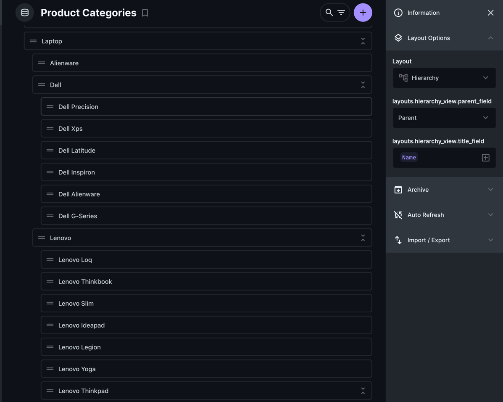

## Hierarchy Layout

### Screenshots


## Installation
```bash
npm i directus-extension-hierarchy-layout
```

## Usage
- Go to your Directus content page
- Right side of the page, click on the "Layout" dropdown
- Select "Hierarchy"
- Select field related to hierarchy
- Select Field for display


## TODO
- [ ] Quick create item on tree
- [ ] Update i18n text translate
